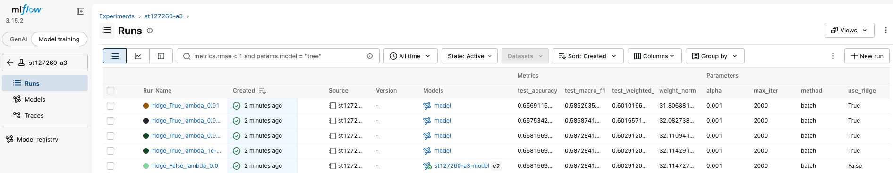
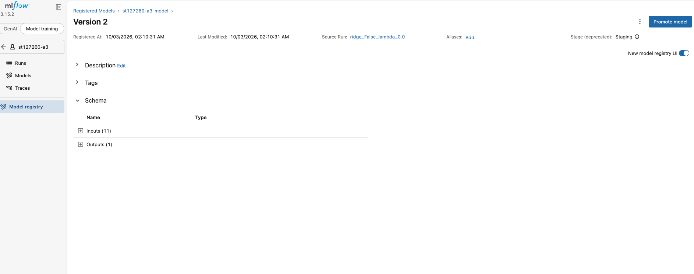
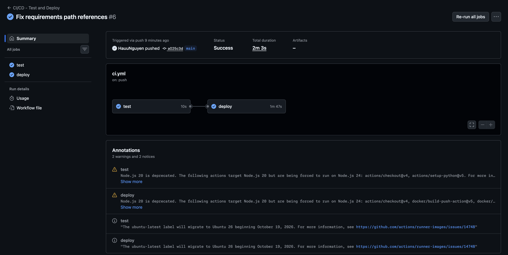

# Assignment 3: Car Price Classification

**Student:** Nguyen Cong Hau (st127260)
**Course:** AT82.03 Machine Learning

---

## Overview

This assignment reframes the Car Price Prediction problem (A1/A2) as a
**4-class classification problem**: predicting a price bucket instead of
the exact selling price. A multinomial Logistic Regression model is
implemented from scratch (based on `02 - Multinomial Logistic Regression.ipynb`),
extended with Ridge (L2) regularization, custom evaluation metrics, and a
full CI/CD pipeline.

---

## Repository Structure
A3/
├── st127260.ipynb # Main notebook: Tasks 1, 2, 3 (Objectives 1 & 2)
├── model.py # LogisticRegression class (used by unit tests & app)
├── tests/
│ └── test_model.py # Unit tests for Objective 3
├── .github/workflows/
│ └── ci.yml # GitHub Actions: test -> build & push Docker image
├── app/
│ ├── app.py # Dash web app (A1 / A2 / A3 model selector)
│ ├── model.py # LogisticRegression (A3, for unpickling model_a3.pkl)
│ ├── models.py # LinearRegression + penalties (A2, for unpickling model_a2.pkl)
│ ├── model_a3.pkl # Trained best A3 classification model
│ ├── model_a2.pkl # Trained A2 regression model
│ ├── meta_a3.pkl # Price bin edges + feature names for A3
│ ├── preprocessor.pkl # Shared preprocessing pipeline (A1/A2/A3)
│ ├── car_price_model.joblib # A1 scikit-learn pipeline
│ ├── Dockerfile
│ ├── docker-compose.yml
│ └── requirements.txt
├── datasets/
│ └── Cars.csv
├── mlflow.db / mlruns/ # Local MLflow tracking (SQLite backend)
└── *.png # Screenshots (MLflow runs, Model Registry, CI/CD)


---

## Task 1: Classification Metrics from Scratch

Implemented `accuracy`, per-class `precision`/`recall`/`f1_score`,
`macro_*`, and `weighted_*` averages, all verified against
`sklearn.metrics` — first on mockup data, then on real model predictions.

- **Label construction:** `selling_price` is bucketed into 4 classes
  using `pd.qcut()` (quantile-based bins) rather than `pd.cut()`
  (equal-width bins). `pd.cut()` was shown to place ~95% of samples in
  Class 0 due to the right-skewed price distribution — `pd.qcut()` gives
  roughly balanced classes (~25% each), motivating the need for macro/
  weighted metrics in the first place.
- **Verification:** All custom metrics matched sklearn exactly, both on
  mockup data (e.g. macro F1: 0.7083 vs 0.7083) and on the real test set
  (accuracy: 0.6582, matching `classification_report`).
- **`support`** in `classification_report` = the number of true samples
  per class in `y_true`; used as the weighting factor for weighted
  averages.

## Task 2: Ridge (L2) Regularization

Added `use_ridge` / `l` parameters to the `LogisticRegression` class,
implementing the penalty `λΣθ²` directly in the loss and gradient
(formula verified independently on mock values before integration).

A ridge-strength sweep (`λ = 0, 1e-5, 1e-4, 1e-3, 1e-2`) showed the
weight norm shrinking monotonically as λ increases (confirming the
penalty works correctly), though the unregularized model performed best
on this dataset/configuration — indicating the baseline is not
significantly overfitting at `alpha=0.001, max_iter=2000, batch`.

## Task 3: Deployment

### Objectives 1 & 2 — MLflow Logging & Model Registry

Experiments were logged to a **local MLflow server** (SQLite-backed,
`http://127.0.0.1:5001`) instead of the course server
(`mlflow.ml.brain.cs.ait.ac.th`), per the TA's updated grading
instructions — the course MLflow server was confirmed down by the TA and
logging/registering locally with screenshots was made acceptable for
full marks. A SQLite-backed server (rather than `file:./mlruns`) was used
because file-store does not support Model Registry.

**Experiment Runs (Objective 1):**


| use_ridge | ridge_lambda | test_accuracy | test_macro_f1 | weight_norm |
|---|---|---|---|---|
| False | 0.0     | 0.6582 | 0.5873 | 32.1147 |
| True  | 0.00001 | 0.6582 | 0.5873 | 32.1143 |
| True  | 0.0001  | 0.6582 | 0.5873 | 32.1109 |
| True  | 0.001   | 0.6575 | 0.5859 | 32.0827 |
| True  | 0.01    | 0.6569 | 0.5853 | 31.8069 |

**Registered Model at Staging (Objective 2):**
The best run (no-ridge, test macro F1 = 0.5873) was registered as
`st127260-a3-model` and transitioned to the **Staging** stage.



### Objective 3 — CI/CD

- **Unit tests** (`tests/test_model.py`): (1) model accepts the expected
  input shape and trains successfully, (2) `predict()` output has the
  expected shape and valid class range.
- **GitHub Actions** (`.github/workflows/ci.yml`): runs unit tests on
  every push to `main`. A second job (`deploy`), gated by `needs: test`,
  only runs if tests pass — it builds the Docker image from `app/` and
  pushes it to Docker Hub automatically.



**Note on production deployment:** The CI/CD pipeline automates
deployment up to pushing the image to Docker Hub. Deploying the pulled
image onto the course server (`ml-brain`) requires manually running
`docker compose pull && docker compose up -d` there, since:
1. The server requires SSH through a bastion host (`bazooka`) with
   interactive password authentication, which GitHub Actions' free-tier
   runners cannot perform securely/automatically.
2. At the time of testing, the server's shared Docker network (`web`,
   used by Traefik for routing) was unavailable
   (`docker network inspect web` → "network web not found"), which is a
   server-side infrastructure issue outside this project's control.

The Docker image itself builds and runs successfully, both locally and
via the automated CI/CD pipeline (confirmed by the GitHub Actions run
above).

---

## How to Run

### Notebook
```bash
pip install -r app/requirements.txt mlflow jupyter
jupyter notebook st127260.ipynb
```

### Local MLflow server (for Objectives 1 & 2)
```bash
mlflow server --backend-store-uri sqlite:///mlflow.db --default-artifact-root ./mlartifacts --port 5001
```

### Unit tests
```bash
pip install pytest numpy
pytest tests/ -v
```

### Web app (Docker)
```bash
cd app
docker build -t car-price-a3 .
docker run -p 8050:8050 car-price-a3
```
Then open `http://localhost:8050`.

---

## Model Summary

| Model | Type | Test Performance |
|---|---|---|
| A1 | Scikit-learn Random Forest (regression) | R² = 0.946 |
| A2 | Custom SGD + Momentum Linear Regression | R² = 0.8635 |
| A3 | Custom Multinomial Logistic Regression (4-class) | Accuracy = 0.6582, Macro F1 = 0.5873 |